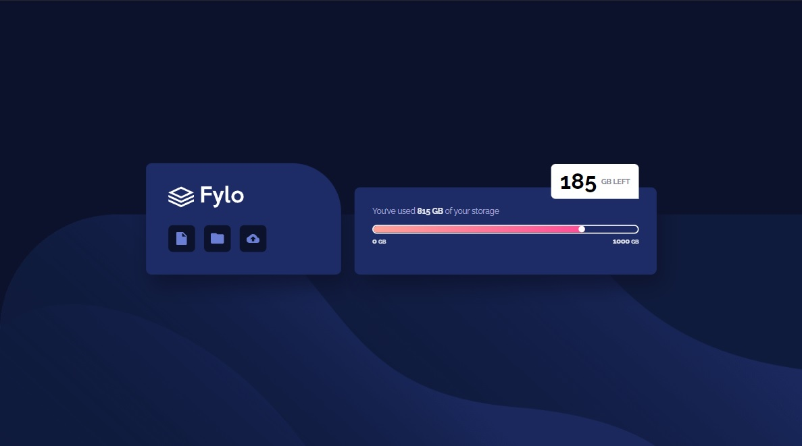
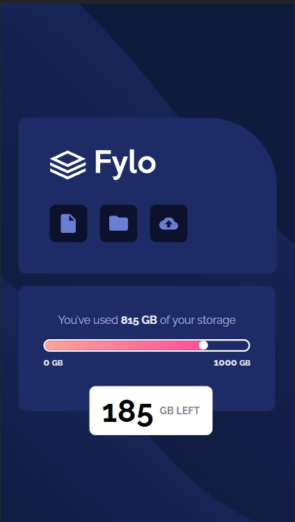

# Frontend Mentor - Fylo data storage component solution

This is a solution to the [Fylo data storage component challenge on Frontend Mentor](https://www.frontendmentor.io/challenges/fylo-data-storage-component-1dZPRbV5n). Frontend Mentor challenges help you improve your coding skills by building realistic projects.

## Table of contents

- [Overview](#overview)
  - [The challenge](#the-challenge)
  - [Screenshot](#screenshot)
  - [Links](#links)
- [My process](#my-process)
  - [Built with](#built-with)
  - [What I learned](#what-i-learned)
  - [Continued development](#continued-development)
  - [Useful resources](#useful-resources)
- [Author](#author)
- [Acknowledgments](#acknowledgments)

## Overview

### The challenge

Users should be able to:

- View the optimal layout for the site depending on their device's screen size

### Screenshot




### Links

- [Solution URL](https://your-solution-url.com)
- [Live site URL](https://zp021-frontend-mentor-fylo-storage.netlify.app)

## My process

### Built with

- Semantic HTML5 markup
- CSS custom properties
- Flexbox
- JavaScript
- Mobile-first workflow

### What I learned

This relatively simple challenge took me a week, because of the progress bar and counter feature I wanted to add. I eventually got it to work after a lot of googling, and trying out different things.

```html
<p class="storage-info">
  You’ve used <span class="storage-used" data-number="815">0</span
  ><abbr> GB</abbr> of your storage
</p>

<span style="width: 0" class="storage-meter" data-width="80%"></span>
<span
  style="left: -0.7rem;"
  class="point"
  data-position="calc(80% - 0.7rem)"
></span>
```

```js
window.onload = function () {
  storageMeter.style.width = storageMeter.dataset.width;
  point.style.left = point.dataset.position;

  let gbUsed = setInterval(() => {
    storageUsed.textContent++;
    if (storageUsed.textContent == used) {
      clearInterval(gbUsed);
    }
  });

  let gbCount = setInterval(() => {
    storageNumber.textContent++;
    if (storageNumber.textContent == storage) {
      clearInterval(gbCount);
    }
  }, 10);
};
```

### Continued development

I would like to focus on learnig more JavaScript and implementing it in al challenges in some way efen if its not part of the challenge.

### Useful resources

- [How TO - JavaScript Progress Bar](https://www.w3schools.com/howto/howto_js_progressbar.asp)
- [setInterval()](https://developer.mozilla.org/en-US/docs/Web/API/setIntervalp)

## Author

- Frontend Mentor - [@zp021](https://www.frontendmentor.io/profile/zp021)
- GitHub - [@zp021](https://github.com/zp021)
